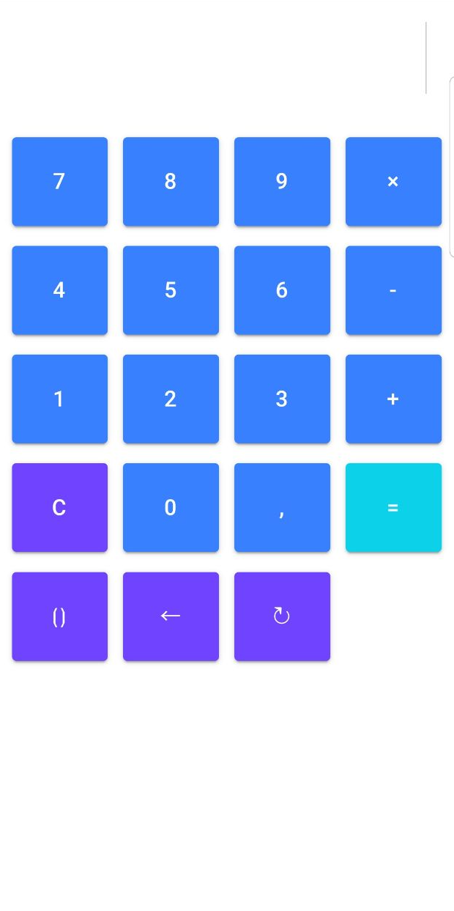

# The Simple Ionic Powered Calculator
Simple calculator using Ionic and Math.js.

If you like my project, "Star" in the corresponding project right corner, please. If you want to buy me a cup of coffee, use the Bitcoin QR Code right below.

<div align="center">
  
</div>

BTC Address: 14pmyZZrFfCCEK49FC7jKWj1WGzhUP4rsQ


<div align="center">
  
</div>


## Installation

Install dependencies.

```js
git clone https://github.com/localhostport80/simplecalc && cd simplecalc
npm install
```

## Building

### DevApp

Run it inside Ionic DevApp.

```bash
ionic serve --devapp
```

### Release

Build it for the specific platform.

```bash
ionic cordova build --release <platform>
```

## Usage

SimpleCalc supports the following gestures:

* Swipe Down: Get Result.
* Swipe Up: Clear Input.
* Swipe Left: Delete Last Character.
* Swipe Right: Redo Last Character.
